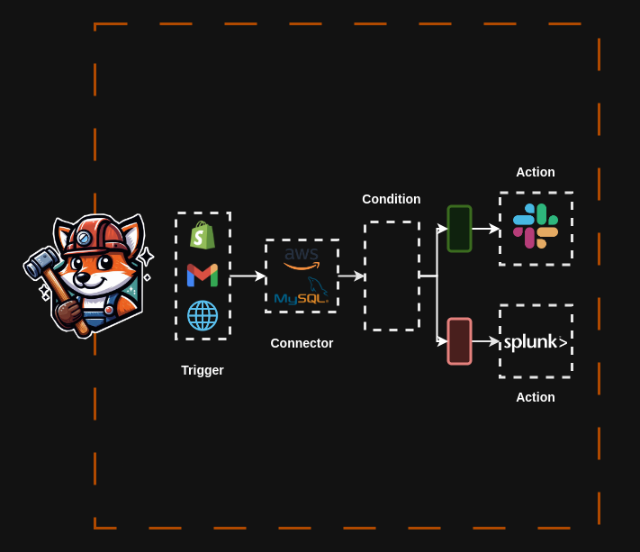

    

## What is Zentelio
Zentelio is a low-code framework designed for developing workflows in applications, services, and systems using a trigger-action-connector. 
Although Zentelio is written in Java and Rust, it is not necessary to know this languages, as Zentelio operates based on Json, Yaml, and ZScript for constructing workflows. If required, plugins can be created in Java to incorporate new elements into Zentelio.

## Uses of Zentelio

Zentelio can be utilized in a variety of scenarios. Below are detailed examples in different domains: 

**Order Management** 
In a company that needs to automate order management, Zentelio can establish a workflow that activates upon receiving an order, verifies available inventory, notifies the sales team, and generates a shipping order.

**IT Infrastructure Management** 
In the IT domain, Zentelio can be employed for infrastructure management, activating maintenance and monitoring actions in response to specific system events. For instance, upon detecting a potential server failure, it can execute a diagnostic script, send alerts to the support team, and schedule a maintenance task if necessary. 

**Automated Marketing**
In marketing, Zentelio can coordinate automated campaigns. A trigger such as a newsletter subscription can initiate a series of actions, including sending welcome emails, updating customer databases, and segmenting new subscribers for future personalized campaigns. 

**Data Science** 
In the field of data science, Zentelio can automate analytical and modeling processes. For example, it can receive real-time data from various sources, automatically clean and preprocess the data, train predictive models based on the received data, and generate and send reports with analysis results to stakeholders. 

**Artificial Intelligence** 
For artificial intelligence applications, Zentelio can manage the deployment and maintenance of AI models. For instance, it can detect new updates in training data, retrain AI models automatically, deploy the new models to production, and monitor model performance, adjusting parameters in real-time if necessary. 

**API Integration**
In API integration, Zentelio can facilitate communication between different systems and services. For example, it can receive data from an external API, transform the data according to internal system requirements, send the transformed data to a database or another API, and manage errors and retries automatically in case of communication failures.

## How Zentelio works

Zentelio is designed to eliminate the need for complex programming in the initial stages of a project. Although it is based on Java and Rust, its core functionality relies on Json schemas for components, Yaml for configurations and properties, and ZScript, which extends Json capabilities by enabling script execution within Json schemas.

Unlike traditional frameworks that are integrated directly into a project, Zentelio is installed as standalone software. It offers commands that facilitate various actions, such as generating a project, compiling it, executing workflows, and more.

This is achieved through the ZVM, a virtual machine that encapsulates the entire Zentelio environment. The ZVM includes the ZScript interpreter, a bytecode compiler, the logic for triggers, actions, and connectors, as well as the plugin system, among other essential components.

Zentelio comes with several default triggers and connectors, such as Http Trigger, Websocket Trigger, Kafka Trigger, and Scheduler Trigger. However, if additional triggers or connectors are needed, plugins can be created in Java to integrate these new elements, making them available for use in projects.